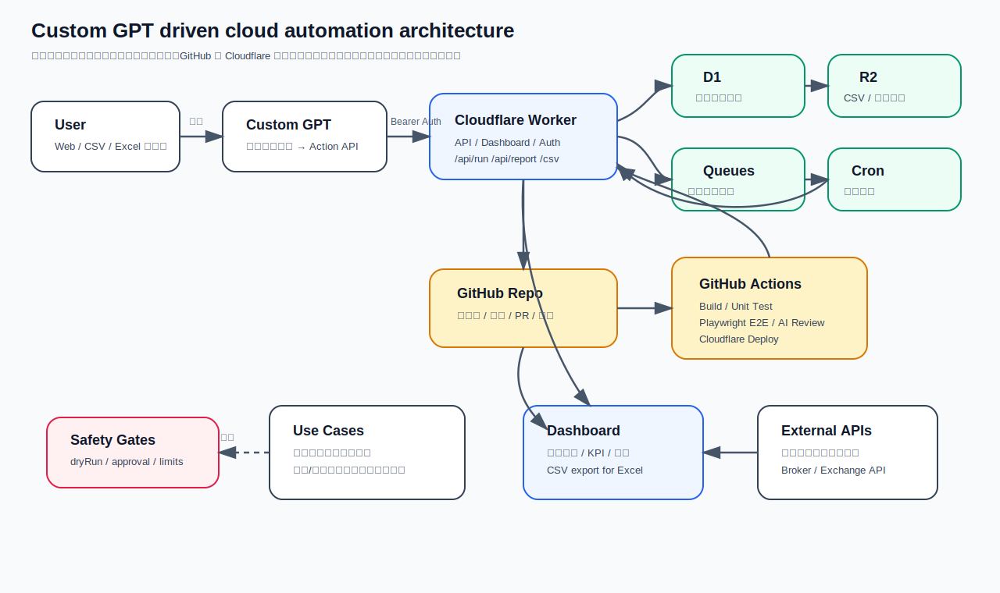
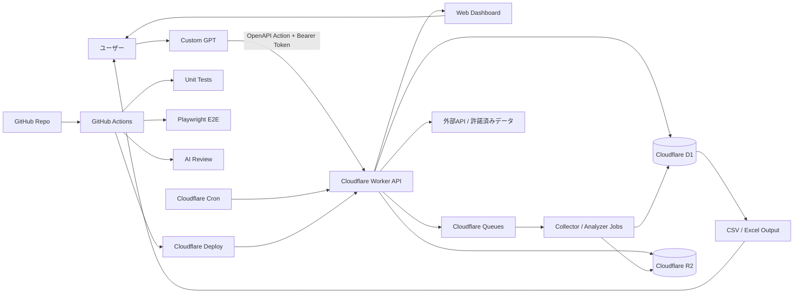

# Autonomous Cloud Business Automation

Custom GPT から一括指示を出し、GitHub / Cloudflare 上で「収集 → 分析 → Web表示 → CSV出力 → テスト → デプロイ」まで流すための標準テンプレートです。

初期状態では安全のため、株式・暗号資産の **ライブ自動売買は無効**、データ収集も **サンプルコネクタ / 正規API前提** です。実運用では、利用するサイト・API・証券会社・取引所・クラウドの規約、法令、リスク管理を確認してください。



---

## 1. 今までの話のまとめ

やりたいことは、ユーザーが毎回細かい作業をせず、Custom GPT に自然言語で指示するだけで、次の一連の処理が自動で走る仕組みです。

- 不動産物件の情報収集、利回り・相場差分・リスク分析
- 物販 / 転売候補の商品、仕入れ先、販売価格、利益率の整理
- 株式投資 / 仮想通貨の自動売買シミュレーション、バックテスト、パフォーマンス確認
- ユーザーは Web 画面または CSV / Excel で最終アウトプットだけ確認
- 修正指示があった場合も、コード更新、テスト、E2E、デプロイまで自動実行
- できるだけ処理は Cloudflare などのクラウド側に寄せる

---

## 2. 標準アーキテクチャ



### 各レイヤーの役割

| レイヤー | 役割 |
|---|---|
| Custom GPT | 自然言語指示を受け、定義済み Action API を呼ぶ |
| GitHub | コード、テスト、設定、履歴、Pull Request を管理 |
| GitHub Actions | build、unit test、E2E、AIレビュー、Cloudflare deploy を自動実行 |
| Cloudflare Workers | Web画面、API、軽量ジョブ、Webhook受け口 |
| Cloudflare D1 | 物件、商品、価格、シミュレーション結果などの構造化データ |
| Cloudflare R2 | 生データ、CSV、スクリーンショット、レポート |
| Cloudflare Queues | 収集・分析など時間がかかる処理の非同期化 |
| Cloudflare Cron | 定期実行。例: 6時間ごとにデータ更新 |
| Playwright | Web画面を実ブラウザで操作して最終確認 |
| AI Review | ログ、画面、レポートの異常検知補助 |

---

## 3. このリポジトリに入っているもの

- Cloudflare Workers ベースの Web ダッシュボード
- `/api/run` でジョブ実行
- `/api/report` で最新結果確認
- `/api/export.csv` で Excel 取り込み用 CSV 出力
- 不動産、物販、投資シミュレーションのサンプル分析ジョブ
- GitHub Actions による TypeScript build、unit test、Playwright E2E、Cloudflare deploy
- Custom GPT Actions 用 OpenAPI スキーマ
- Custom GPT Instructions 雛形
- 初期設定ガイド

---

## 4. ローカルで動かす

```bash
npm install
npm run build
npm test
npm run dev
```

ブラウザで開きます。

```text
http://127.0.0.1:8787
```

CSV は以下で確認できます。

```bash
curl http://127.0.0.1:8787/api/export.csv
```

---

## 5. GitHub 側の初期設定

### 5.1 Repository Secrets

GitHub のリポジトリ画面で `Settings > Secrets and variables > Actions` を開き、以下を登録します。

| Secret | 用途 |
|---|---|
| `CLOUDFLARE_API_TOKEN` | GitHub Actions から Cloudflare にデプロイするため |
| `CLOUDFLARE_ACCOUNT_ID` | Cloudflare アカウント指定 |
| `WORKER_BASE_URL` | デプロイ済み Worker URL。E2E や本番確認で使用 |
| `GPT_ACTION_TOKEN` | Custom GPT から Worker API を呼ぶための Bearer Token |
| `OPENAI_API_KEY` | AIレビューを実装する場合のみ |

### 5.2 Environment

`Settings > Environments` で `production` を作成します。

推奨設定:

- main ブランチだけデプロイ可能にする
- 最初は Required reviewers を 1 名以上にする
- 完全自動に移行する場合も、ライブ取引や本番発注は別承認を残す

### 5.3 Branch protection

`Settings > Branches` で `main` を保護します。

推奨設定:

- Pull Request 必須
- CI 成功必須
- 直接 push 禁止
- 管理者にも適用

---

## 6. Cloudflare 側の初期設定

### 6.1 ログイン

```bash
npm install
npx wrangler login
```

### 6.2 D1 データベース作成

```bash
npx wrangler d1 create business_automation
```

出力された `database_id` を `wrangler.toml` の `database_id` に貼り付けます。

### 6.3 R2 バケット作成

```bash
npx wrangler r2 bucket create business-automation-reports
```

### 6.4 Queue 作成

```bash
npx wrangler queues create automation-jobs
```

### 6.5 Secrets 登録

```bash
npx wrangler secret put GPT_ACTION_TOKEN
npx wrangler secret put OPENAI_API_KEY
```

`OPENAI_API_KEY` は AIレビューを実際に使う場合のみ必要です。

### 6.6 デプロイ

```bash
npm run deploy
```

---

## 7. Custom GPT 側の初期設定

### 7.1 必要なもの

- デプロイ済み Cloudflare Worker URL
- `GPT_ACTION_TOKEN` として使うランダムな長いトークン
- `docs/custom-gpt/openapi.yaml`
- `docs/custom-gpt/instructions.md`

### 7.2 設定手順

1. ChatGPT で GPT 作成画面を開く。
2. Instructions に `docs/custom-gpt/instructions.md` の内容を貼り付ける。
3. Actions を追加する。
4. Authentication は API Key / Bearer Token 方式にする。
5. Schema に `docs/custom-gpt/openapi.yaml` を貼り付ける。
6. `servers.url` を本番 Worker URL に差し替える。
7. `/api/health` または `/api/report` を呼んで接続確認する。

### 7.3 指示と実行の対応

| ユーザー指示 | API実行 |
|---|---|
| 不動産分析を更新して | `/api/run` に `scenario=real_estate` |
| 物販候補を更新して | `/api/run` に `scenario=resale` |
| 投資シミュレーションを回して | `/api/run` に `scenario=trading_sim` |
| 全部更新して | `/api/run` に `scenario=all` |
| 最新レポートを見せて | `/api/report` |
| Excel用CSVを出して | `/api/export.csv` |

---

## 8. 実装手順

### Phase 1: 安全な土台

- Web ダッシュボードを Cloudflare Workers にデプロイ
- CSV / Excel 出力を実装
- 不動産・物販・投資シミュレーションはサンプルデータで確認
- CI / E2E が通る状態にする

### Phase 2: 正規データソース接続

- 不動産 API、商品 API、価格 API、金融データ API を接続
- 利用規約、レート制限、保存可能範囲を確認
- D1 / R2 に保存

### Phase 3: AIレビュー

- Playwright のスクリーンショットとレポートを保存
- AI が「画面が空でないか」「異常値がないか」「エラーがないか」を補助判定
- ただし AI だけでライブ発注・ライブ取引は許可しない

### Phase 4: 修正・PR・デプロイ自動化

- Custom GPT から修正指示
- GitHub Actions / 専用中継 API がブランチ作成
- テスト成功後 PR 作成
- 承認後 main に merge
- Cloudflare に自動デプロイ

### Phase 5: 本番実行の高度化

- 取引 / 発注は paper trading から開始
- 発注上限、損失上限、緊急停止、監査ログ、人間承認を追加
- その後、必要に応じて限定的にライブ実行

---

## 9. 安全設計

- `ALLOW_LIVE_TRADING=false` が初期値です。
- いきなり本番売買や本番発注をしないため、`APPROVAL_REQUIRED=true` を初期値にしています。
- スクレイピングではなく、正規 API / 許諾済みデータソースを優先します。
- Custom GPT からの API 呼び出しは Bearer Token で保護します。
- 本番デプロイは GitHub Environments と Secrets を使って管理する前提です。

---

## 10. ファイル構成

```text
.
├── README.md
├── docs/
│   ├── assets/architecture.svg
│   └── custom-gpt/
│       ├── instructions.md
│       └── openapi.yaml
├── src/index.ts
├── test/index.test.ts
├── e2e/dashboard.spec.ts
├── package.json
├── wrangler.toml
├── playwright.config.ts
└── .github/workflows/ci-cd.yml
```
