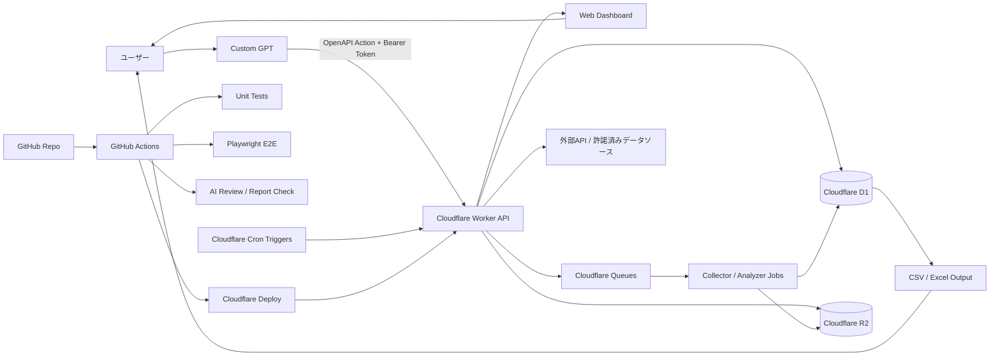

# 全体アーキテクチャ

## 標準構成

## 役割分担

| レイヤー | 役割 |
|---|---|
| Custom GPT | ユーザーの自然言語指示を受け、定義済み Action API を呼び出す |
| GitHub | コード、テスト、設定、履歴、Pull Request、レビューを管理 |
| GitHub Actions | build、unit test、E2E、AIレビュー、Cloudflare deploy を自動実行 |
| Cloudflare Workers | Web画面、API、軽量ジョブ、Webhook受け口を担当 |
| Cloudflare D1 | 物件、商品、価格、取引シミュレーション結果などの構造化データを保存 |
| Cloudflare R2 | 生データ、CSV、スクリーンショット、レポートなどを保存 |
| Cloudflare Queues | 収集・分析など、時間がかかる処理を非同期化 |
| Cloudflare Cron Triggers | 定期実行。例: 6時間ごとにデータ更新 |
| Playwright | Web画面を実ブラウザで操作して最終チェック |
| AI Review | ログ、スクリーンショット、レポートを評価する補助レイヤー |

## なぜこの構成か

- ユーザー側は Web 画面 / CSV / Excel だけ見ればよい。
- コード修正から本番反映まで GitHub Actions に集約できる。
- 処理の大半を Cloudflare 側に寄せられる。
- Cloudflare Workers で Web と API を同じデプロイ単位にできる。
- D1 / R2 / Queues / Cron を使うと、小規模から始めて段階的に拡張しやすい。

## 本番前に必ず決めること

1. データソースは正規 API か、取得許可のあるサイトか。
2. 株式・暗号資産はシミュレーションか、ライブ取引か。
3. ライブ取引を行う場合、発注上限、損失上限、承認フロー、監査ログをどうするか。
4. 本番デプロイに人間の承認を残すか、完全自動にするか。
5. 個人情報・機密情報・APIキーをどこに保存するか。
